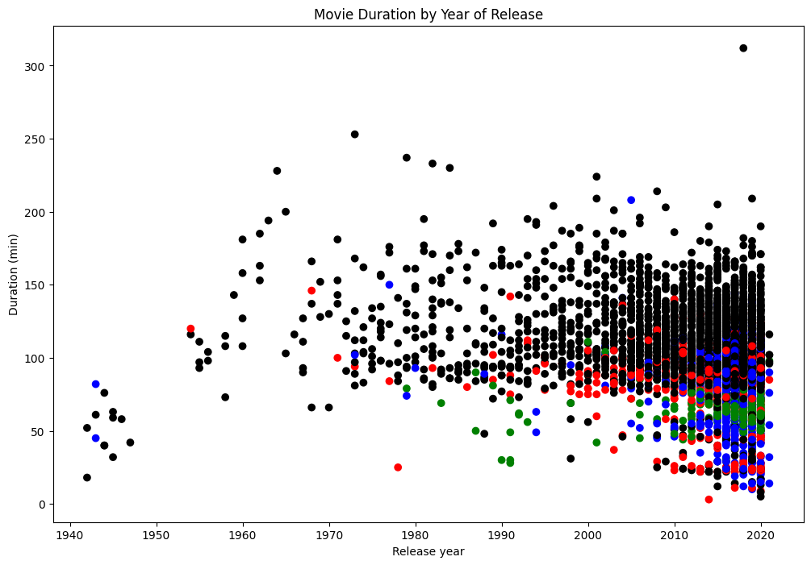

**Netflix**! What started in 1997 as a DVD rental service has since exploded into one of the largest entertainment and media companies.

Given the large number of movies and series available on the platform, it is a perfect opportunity to flex your exploratory data analysis skills and dive into the entertainment industry. Our friend has also been brushing up on their Python skills and has taken a first crack at a CSV file containing Netflix data. They believe that the average duration of movies has been declining. Using your friends initial research, you'll delve into the Netflix data to see if you can determine whether movie lengths are actually getting shorter and explain some of the contributing factors, if any.

You have been supplied with the dataset `netflix_data.csv` , along with the following table detailing the column names and descriptions:

## The data
### **netflix_data.csv**
| Column | Description |
|--------|-------------|
| `show_id` | The ID of the show |
| `type` | Type of show |
| `title` | Title of the show |
| `director` | Director of the show |
| `cast` | Cast of the show |
| `country` | Country of origin |
| `date_added` | Date added to Netflix |
| `release_year` | Year of Netflix release |
| `duration` | Duration of the show in minutes |
| `description` | Description of the show |
| `genre` | Show genre |


```python
# Importing pandas and matplotlib
import pandas as pd
import matplotlib.pyplot as plt
```

Load the CSV file and store as netflix_df


```python
csv_file_path = 'netflix_data.csv'

netflix_df = pd.read_csv(csv_file_path)
netflix_df
```
<div>
<table border="1" class="dataframe">
  <thead>
    <tr style="text-align: right;">
      <th></th>
      <th>show_id</th>
      <th>type</th>
      <th>title</th>
      <th>director</th>
      <th>cast</th>
      <th>country</th>
      <th>date_added</th>
      <th>release_year</th>
      <th>duration</th>
      <th>description</th>
      <th>genre</th>
    </tr>
  </thead>
  <tbody>
    <tr>
      <th>0</th>
      <td>s1</td>
      <td>TV Show</td>
      <td>3%</td>
      <td>NaN</td>
      <td>João Miguel, Bianca Comparato, Michel Gomes, R...</td>
      <td>Brazil</td>
      <td>August 14, 2020</td>
      <td>2020</td>
      <td>4</td>
      <td>In a future where the elite inhabit an island ...</td>
      <td>International TV</td>
    </tr>
    <tr>
      <th>1</th>
      <td>s2</td>
      <td>Movie</td>
      <td>7:19</td>
      <td>Jorge Michel Grau</td>
      <td>Demián Bichir, Héctor Bonilla, Oscar Serrano, ...</td>
      <td>Mexico</td>
      <td>December 23, 2016</td>
      <td>2016</td>
      <td>93</td>
      <td>After a devastating earthquake hits Mexico Cit...</td>
      <td>Dramas</td>
    </tr>
    <tr>
      <th>2</th>
      <td>s3</td>
      <td>Movie</td>
      <td>23:59</td>
      <td>Gilbert Chan</td>
      <td>Tedd Chan, Stella Chung, Henley Hii, Lawrence ...</td>
      <td>Singapore</td>
      <td>December 20, 2018</td>
      <td>2011</td>
      <td>78</td>
      <td>When an army recruit is found dead, his fellow...</td>
      <td>Horror Movies</td>
    </tr>
    <tr>
      <th>3</th>
      <td>s4</td>
      <td>Movie</td>
      <td>9</td>
      <td>Shane Acker</td>
      <td>Elijah Wood, John C. Reilly, Jennifer Connelly...</td>
      <td>United States</td>
      <td>November 16, 2017</td>
      <td>2009</td>
      <td>80</td>
      <td>In a postapocalyptic world, rag-doll robots hi...</td>
      <td>Action</td>
    </tr>
    <tr>
      <th>4</th>
      <td>s5</td>
      <td>Movie</td>
      <td>21</td>
      <td>Robert Luketic</td>
      <td>Jim Sturgess, Kevin Spacey, Kate Bosworth, Aar...</td>
      <td>United States</td>
      <td>January 1, 2020</td>
      <td>2008</td>
      <td>123</td>
      <td>A brilliant group of students become card-coun...</td>
      <td>Dramas</td>
    </tr>
    <tr>
      <th>...</th>
      <td>...</td>
      <td>...</td>
      <td>...</td>
      <td>...</td>
      <td>...</td>
      <td>...</td>
      <td>...</td>
      <td>...</td>
      <td>...</td>
      <td>...</td>
      <td>...</td>
    </tr>
    <tr>
      <th>7782</th>
      <td>s7783</td>
      <td>Movie</td>
      <td>Zozo</td>
      <td>Josef Fares</td>
      <td>Imad Creidi, Antoinette Turk, Elias Gergi, Car...</td>
      <td>Sweden</td>
      <td>October 19, 2020</td>
      <td>2005</td>
      <td>99</td>
      <td>When Lebanon's Civil War deprives Zozo of his ...</td>
      <td>Dramas</td>
    </tr>
    <tr>
      <th>7783</th>
      <td>s7784</td>
      <td>Movie</td>
      <td>Zubaan</td>
      <td>Mozez Singh</td>
      <td>Vicky Kaushal, Sarah-Jane Dias, Raaghav Chanan...</td>
      <td>India</td>
      <td>March 2, 2019</td>
      <td>2015</td>
      <td>111</td>
      <td>A scrappy but poor boy worms his way into a ty...</td>
      <td>Dramas</td>
    </tr>
    <tr>
      <th>7784</th>
      <td>s7785</td>
      <td>Movie</td>
      <td>Zulu Man in Japan</td>
      <td>NaN</td>
      <td>Nasty C</td>
      <td>NaN</td>
      <td>September 25, 2020</td>
      <td>2019</td>
      <td>44</td>
      <td>In this documentary, South African rapper Nast...</td>
      <td>Documentaries</td>
    </tr>
    <tr>
      <th>7785</th>
      <td>s7786</td>
      <td>TV Show</td>
      <td>Zumbo's Just Desserts</td>
      <td>NaN</td>
      <td>Adriano Zumbo, Rachel Khoo</td>
      <td>Australia</td>
      <td>October 31, 2020</td>
      <td>2019</td>
      <td>1</td>
      <td>Dessert wizard Adriano Zumbo looks for the nex...</td>
      <td>International TV</td>
    </tr>
    <tr>
      <th>7786</th>
      <td>s7787</td>
      <td>Movie</td>
      <td>ZZ TOP: THAT LITTLE OL' BAND FROM TEXAS</td>
      <td>Sam Dunn</td>
      <td>NaN</td>
      <td>United Kingdom</td>
      <td>March 1, 2020</td>
      <td>2019</td>
      <td>90</td>
      <td>This documentary delves into the mystique behi...</td>
      <td>Documentaries</td>
    </tr>
  </tbody>
</table>
<p>7787 rows × 11 columns</p>
</div>


Filter the data to remove TV shows and store as netflix_subset


```python
netflix_subset = netflix_df[netflix_df["type"] == "Movie"]
netflix_subset
```

<div>
<table border="1" class="dataframe">
  <thead>
    <tr style="text-align: right;">
      <th></th>
      <th>show_id</th>
      <th>type</th>
      <th>title</th>
      <th>director</th>
      <th>cast</th>
      <th>country</th>
      <th>date_added</th>
      <th>release_year</th>
      <th>duration</th>
      <th>description</th>
      <th>genre</th>
    </tr>
  </thead>
  <tbody>
    <tr>
      <th>1</th>
      <td>s2</td>
      <td>Movie</td>
      <td>7:19</td>
      <td>Jorge Michel Grau</td>
      <td>Demián Bichir, Héctor Bonilla, Oscar Serrano, ...</td>
      <td>Mexico</td>
      <td>December 23, 2016</td>
      <td>2016</td>
      <td>93</td>
      <td>After a devastating earthquake hits Mexico Cit...</td>
      <td>Dramas</td>
    </tr>
    <tr>
      <th>2</th>
      <td>s3</td>
      <td>Movie</td>
      <td>23:59</td>
      <td>Gilbert Chan</td>
      <td>Tedd Chan, Stella Chung, Henley Hii, Lawrence ...</td>
      <td>Singapore</td>
      <td>December 20, 2018</td>
      <td>2011</td>
      <td>78</td>
      <td>When an army recruit is found dead, his fellow...</td>
      <td>Horror Movies</td>
    </tr>
    <tr>
      <th>3</th>
      <td>s4</td>
      <td>Movie</td>
      <td>9</td>
      <td>Shane Acker</td>
      <td>Elijah Wood, John C. Reilly, Jennifer Connelly...</td>
      <td>United States</td>
      <td>November 16, 2017</td>
      <td>2009</td>
      <td>80</td>
      <td>In a postapocalyptic world, rag-doll robots hi...</td>
      <td>Action</td>
    </tr>
    <tr>
      <th>4</th>
      <td>s5</td>
      <td>Movie</td>
      <td>21</td>
      <td>Robert Luketic</td>
      <td>Jim Sturgess, Kevin Spacey, Kate Bosworth, Aar...</td>
      <td>United States</td>
      <td>January 1, 2020</td>
      <td>2008</td>
      <td>123</td>
      <td>A brilliant group of students become card-coun...</td>
      <td>Dramas</td>
    </tr>
    <tr>
      <th>6</th>
      <td>s7</td>
      <td>Movie</td>
      <td>122</td>
      <td>Yasir Al Yasiri</td>
      <td>Amina Khalil, Ahmed Dawood, Tarek Lotfy, Ahmed...</td>
      <td>Egypt</td>
      <td>June 1, 2020</td>
      <td>2019</td>
      <td>95</td>
      <td>After an awful accident, a couple admitted to ...</td>
      <td>Horror Movies</td>
    </tr>
    <tr>
      <th>...</th>
      <td>...</td>
      <td>...</td>
      <td>...</td>
      <td>...</td>
      <td>...</td>
      <td>...</td>
      <td>...</td>
      <td>...</td>
      <td>...</td>
      <td>...</td>
      <td>...</td>
    </tr>
    <tr>
      <th>7781</th>
      <td>s7782</td>
      <td>Movie</td>
      <td>Zoom</td>
      <td>Peter Hewitt</td>
      <td>Tim Allen, Courteney Cox, Chevy Chase, Kate Ma...</td>
      <td>United States</td>
      <td>January 11, 2020</td>
      <td>2006</td>
      <td>88</td>
      <td>Dragged from civilian life, a former superhero...</td>
      <td>Children</td>
    </tr>
    <tr>
      <th>7782</th>
      <td>s7783</td>
      <td>Movie</td>
      <td>Zozo</td>
      <td>Josef Fares</td>
      <td>Imad Creidi, Antoinette Turk, Elias Gergi, Car...</td>
      <td>Sweden</td>
      <td>October 19, 2020</td>
      <td>2005</td>
      <td>99</td>
      <td>When Lebanon's Civil War deprives Zozo of his ...</td>
      <td>Dramas</td>
    </tr>
    <tr>
      <th>7783</th>
      <td>s7784</td>
      <td>Movie</td>
      <td>Zubaan</td>
      <td>Mozez Singh</td>
      <td>Vicky Kaushal, Sarah-Jane Dias, Raaghav Chanan...</td>
      <td>India</td>
      <td>March 2, 2019</td>
      <td>2015</td>
      <td>111</td>
      <td>A scrappy but poor boy worms his way into a ty...</td>
      <td>Dramas</td>
    </tr>
    <tr>
      <th>7784</th>
      <td>s7785</td>
      <td>Movie</td>
      <td>Zulu Man in Japan</td>
      <td>NaN</td>
      <td>Nasty C</td>
      <td>NaN</td>
      <td>September 25, 2020</td>
      <td>2019</td>
      <td>44</td>
      <td>In this documentary, South African rapper Nast...</td>
      <td>Documentaries</td>
    </tr>
    <tr>
      <th>7786</th>
      <td>s7787</td>
      <td>Movie</td>
      <td>ZZ TOP: THAT LITTLE OL' BAND FROM TEXAS</td>
      <td>Sam Dunn</td>
      <td>NaN</td>
      <td>United Kingdom</td>
      <td>March 1, 2020</td>
      <td>2019</td>
      <td>90</td>
      <td>This documentary delves into the mystique behi...</td>
      <td>Documentaries</td>
    </tr>
  </tbody>
</table>
<p>5377 rows × 11 columns</p>
</div>

Investigate the Netflix movie data, keeping only the columns "title", "country", "genre", "release_year", "duration", and saving this into a new DataFrame called netflix_movies.

```python
netflix_movies = netflix_subset[["title", "country", "genre", "release_year", "duration"]]
netflix_movies
```

<div>
<table border="1" class="dataframe">
  <thead>
    <tr style="text-align: right;">
      <th></th>
      <th>title</th>
      <th>country</th>
      <th>genre</th>
      <th>release_year</th>
      <th>duration</th>
    </tr>
  </thead>
  <tbody>
    <tr>
      <th>1</th>
      <td>7:19</td>
      <td>Mexico</td>
      <td>Dramas</td>
      <td>2016</td>
      <td>93</td>
    </tr>
    <tr>
      <th>2</th>
      <td>23:59</td>
      <td>Singapore</td>
      <td>Horror Movies</td>
      <td>2011</td>
      <td>78</td>
    </tr>
    <tr>
      <th>3</th>
      <td>9</td>
      <td>United States</td>
      <td>Action</td>
      <td>2009</td>
      <td>80</td>
    </tr>
    <tr>
      <th>4</th>
      <td>21</td>
      <td>United States</td>
      <td>Dramas</td>
      <td>2008</td>
      <td>123</td>
    </tr>
    <tr>
      <th>6</th>
      <td>122</td>
      <td>Egypt</td>
      <td>Horror Movies</td>
      <td>2019</td>
      <td>95</td>
    </tr>
    <tr>
      <th>...</th>
      <td>...</td>
      <td>...</td>
      <td>...</td>
      <td>...</td>
      <td>...</td>
    </tr>
    <tr>
      <th>7781</th>
      <td>Zoom</td>
      <td>United States</td>
      <td>Children</td>
      <td>2006</td>
      <td>88</td>
    </tr>
    <tr>
      <th>7782</th>
      <td>Zozo</td>
      <td>Sweden</td>
      <td>Dramas</td>
      <td>2005</td>
      <td>99</td>
    </tr>
    <tr>
      <th>7783</th>
      <td>Zubaan</td>
      <td>India</td>
      <td>Dramas</td>
      <td>2015</td>
      <td>111</td>
    </tr>
    <tr>
      <th>7784</th>
      <td>Zulu Man in Japan</td>
      <td>NaN</td>
      <td>Documentaries</td>
      <td>2019</td>
      <td>44</td>
    </tr>
    <tr>
      <th>7786</th>
      <td>ZZ TOP: THAT LITTLE OL' BAND FROM TEXAS</td>
      <td>United Kingdom</td>
      <td>Documentaries</td>
      <td>2019</td>
      <td>90</td>
    </tr>
  </tbody>
</table>
<p>5377 rows × 5 columns</p>
</div>


Filter netflix_movies to find the movies that are shorter than 60 minutes, saving the resulting DataFrame as short_movies; inspect the result to find possible contributing factors.


```python
short_movies = netflix_movies[netflix_movies.duration< 60]
short_movies
```

<div>
<table border="1" class="dataframe">
  <thead>
    <tr style="text-align: right;">
      <th></th>
      <th>title</th>
      <th>country</th>
      <th>genre</th>
      <th>release_year</th>
      <th>duration</th>
    </tr>
  </thead>
  <tbody>
    <tr>
      <th>35</th>
      <td>#Rucker50</td>
      <td>United States</td>
      <td>Documentaries</td>
      <td>2016</td>
      <td>56</td>
    </tr>
    <tr>
      <th>55</th>
      <td>100 Things to do Before High School</td>
      <td>United States</td>
      <td>Uncategorized</td>
      <td>2014</td>
      <td>44</td>
    </tr>
    <tr>
      <th>67</th>
      <td>13TH: A Conversation with Oprah Winfrey &amp; Ava ...</td>
      <td>NaN</td>
      <td>Uncategorized</td>
      <td>2017</td>
      <td>37</td>
    </tr>
    <tr>
      <th>101</th>
      <td>3 Seconds Divorce</td>
      <td>Canada</td>
      <td>Documentaries</td>
      <td>2018</td>
      <td>53</td>
    </tr>
    <tr>
      <th>146</th>
      <td>A 3 Minute Hug</td>
      <td>Mexico</td>
      <td>Documentaries</td>
      <td>2019</td>
      <td>28</td>
    </tr>
    <tr>
      <th>...</th>
      <td>...</td>
      <td>...</td>
      <td>...</td>
      <td>...</td>
      <td>...</td>
    </tr>
    <tr>
      <th>7679</th>
      <td>WWII: Report from the Aleutians</td>
      <td>United States</td>
      <td>Documentaries</td>
      <td>1943</td>
      <td>45</td>
    </tr>
    <tr>
      <th>7692</th>
      <td>Ya no estoy aquí: Una conversación entre Guill...</td>
      <td>NaN</td>
      <td>Documentaries</td>
      <td>2020</td>
      <td>15</td>
    </tr>
    <tr>
      <th>7718</th>
      <td>Yoo Byung Jae: Discomfort Zone</td>
      <td>South Korea</td>
      <td>Stand-Up</td>
      <td>2018</td>
      <td>54</td>
    </tr>
    <tr>
      <th>7771</th>
      <td>Zion</td>
      <td>United States</td>
      <td>Documentaries</td>
      <td>2018</td>
      <td>12</td>
    </tr>
    <tr>
      <th>7784</th>
      <td>Zulu Man in Japan</td>
      <td>NaN</td>
      <td>Documentaries</td>
      <td>2019</td>
      <td>44</td>
    </tr>
  </tbody>
</table>
<p>420 rows × 5 columns</p>
</div>


Using a for loop and if/elif statements, iterate through the rows of netflix_movies and assign colors of your choice to four genre groups ("Children", "Documentaries", "Stand-Up", and "Other" for everything else). Save the results in a colors list. Initialize a figure object called fig and create a scatter plot for movie duration by release year using the colors list to color the points and using the labels "Release year" for the x-axis, "Duration (min)" for the y-axis, and the title "Movie Duration by Year of Release"


```python
# Define an empty list
colors = []

# Iterate over rows of netflix_movies
for label, row in netflix_movies.iterrows() :
    if row["genre"] == "Children" :
        colors.append("red")
    elif row["genre"] == "Documentaries" :
        colors.append("blue")
    elif row["genre"] == "Stand-Up":
        colors.append("green")
    else:
        colors.append("black")
        
# Inspect the first 10 values in your list        
colors[:10]

# Set the figure style and initalize a new figure
fig = plt.figure(figsize=(12,8))

# Create a scatter plot of duration versus release_year
plt.scatter(netflix_movies.release_year, netflix_movies.duration, c=colors)

# Create a title and axis labels
plt.title("Movie Duration by Year of Release")
plt.xlabel("Release year")
plt.ylabel("Duration (min)")

# Show the plot
plt.show()

```


    
After inspecting the plot, answer the question "Are we certain that movies are getting shorter?" by assigning either "yes", "no", or "maybe" to the variable answer.

```python
answer = "maybe"
print(answer)
```

    maybe
    
